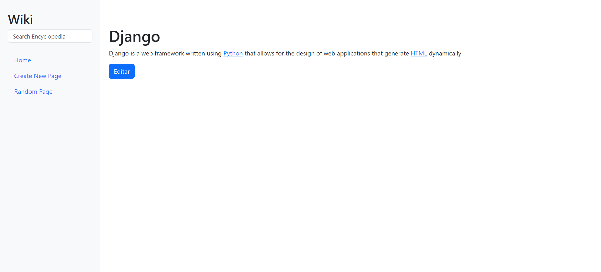
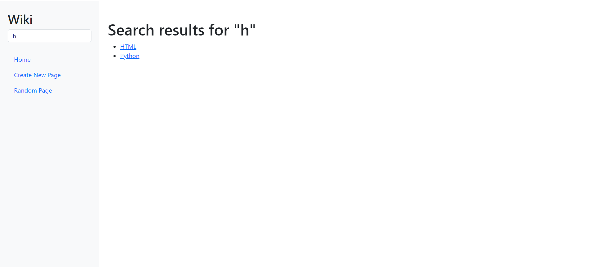
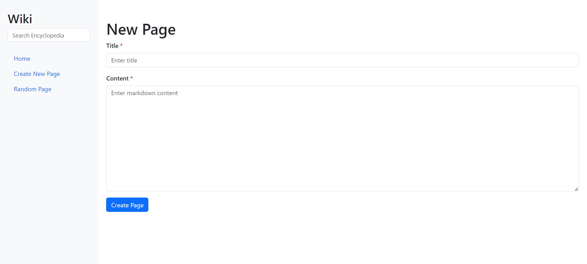
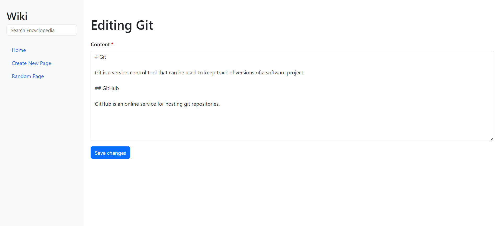
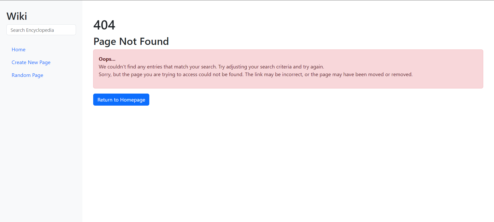

# Harvard University: CS50's Web Project 1 - Wiki

- [Harvard University: CS50's Web Project 1 - Wiki](#harvard-university-cs50s-web-project-1---wiki)
  - [Overview](#overview)
  - [Features](#features)
    - [404 Error Page Setup](#404-error-page-setup)
  - [Requirements](#requirements)
  - [Installation](#installation)
  - [Technologies](#technologies)
  - [Project Structure](#project-structure)

## Overview
This is the **"Wiki"** project, developed as part of the CS50's Web Programming with Python and JavaScript course. This project is an online encyclopedia similar to Wikipedia, where users can view, create, edit, and search entries using Markdown.

## Features
- **Home Page:** Lists all encyclopedia entries and allows navigation to any of them.  
  

- **Entry Page:** Displays the content of a specific encyclopedia entry.  
  

- **Search:** Facilitates searching for entries, returning relevant results.  
  

- **New Page:** Allows the creation of new entries, provided that the title of the new entry does not already exist.  
  

- **Edit Page:** Provides the option to edit the content of any existing entry.  
  

- **Random Page:** Redirects the user to a random entry in the encyclopedia.

- **Markdown to HTML Conversion:** Entries are converted from Markdown to HTML when displayed.

### 404 Error Page Setup
The project includes two approaches for rendering the 404 error page:

- **Custom Middleware:** A custom middleware displays a 404 error page when the debug mode is enabled.

- **Production Setup:** When the project is deployed to a production server and the debug mode is disabled, Django uses its default configuration to display a 404 error page.  
  

## Requirements
- Python 3.12.5
- pip 24.2
- Django 5.1
- markdown 2 2.5.0

## Installation
1. Clone the repository to your local environment:
   ```bash
   git clone <repository-URL>

2. Create and activate a virtual environment:
   ```bash
   python -m venv .venv
   source .venv/bin/activate  # For Unix or MacOS systems
   .\.venv\Scripts\activate  # For Windows PowerShell
   ```

3. Install the required dependencies with the command:
   ```bash
   pip install <dependency-name> or pip install -r requirements.txt
   ```

4. Start the Django development server:
   ```bash
   python manage.py runserver 
   ```

5. Access the application in your browser at  `http://127.0.0.1:8000/`.

## Technologies
- **Front-end:** 
  - HTML 
  - CSS
  - Bootstrap
  - JavaScript


- **Back-end:**
  - Python
  - Django


## Project Structure
- `encyclopedia/` - Main Django application containing all the encyclopedia functionalities.
- `middleware/` - Directory containing the custom middleware for displaying the 404 error page.
- `static/` - Directory for static files such as CSS, JavaScript, and images.
- `templates/` - Contains the HTML templates used to render the encyclopedia pages.
- `forms.py` - Contains the forms used to create and edit  entries.
- `urls.py` - Defines the application's routes and maps URLs to corresponding views.
- `util.py` - Utility file with helper functions.
- `views.py` - Contains the views responsible for processing requests and rendering the appropriate pages.
- `apps.py` - Django application configuration.
- `entries/` - Directory storing all encyclopedia entries in Markdown files.
---
